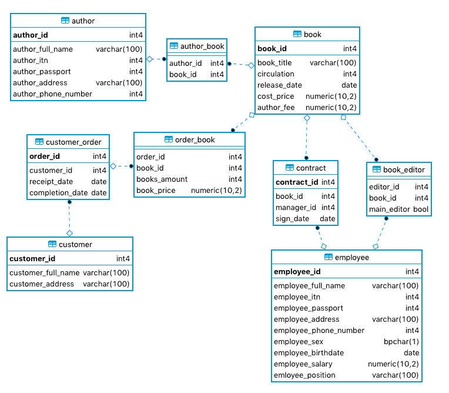
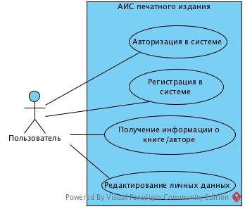
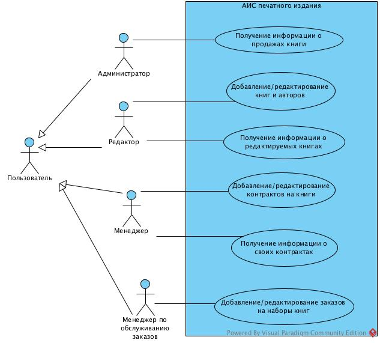

# typography
Web app for typography (university practice)

Simple yet functional application (web site) for typography. Supports several types of users: 
manager, editor, orders manager, administrator.

Registration is only available with "key" generated by administrator (future position is encoded in this key so only administrator can choose it).

Application is powered by Flask and Bootstrap 4. PostgreSQL is used as DBMS.

# DB scheme

# Use case diagram
Sorry for russian on diagram – it is university requirement.
### Common use-cases

### Specific use-cases

